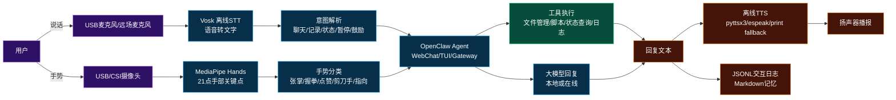
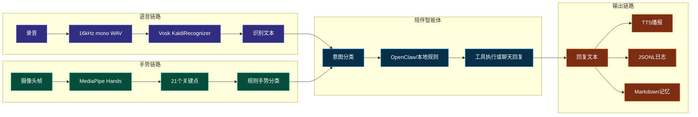
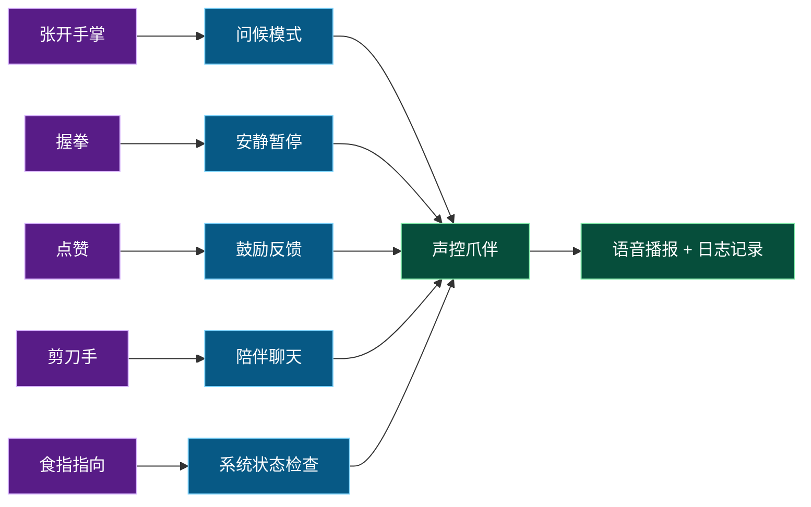

# 声控爪伴：OpenClaw Voice Gesture Companion

> **基于 Jetson Orin Nano Super、Vosk STT、离线 TTS、MediaPipe 手势识别与 OpenClaw 的虚拟陪伴玩伴。**


> 它不是 YOLO 视觉识别项目，而是一个更偏交互体验的边缘 AI Agent：用户可以通过语音和手势与 Jetson 对话，让 OpenClaw 理解意图、调用工具、记录日志、查询状态，并通过语音播报形成陪伴反馈。


## 1. 项目一句话

**声控爪伴**希望把 Jetson Orin Nano Super 从一块“需要键盘、鼠标和命令行操作的开发板”，变成一个“能听、能说、能看懂手势、能调用工具”的虚拟陪伴玩伴。用户可以对麦克风说“帮我记录一下今天的进展”“检查系统状态”“陪我聊聊项目”，也可以对摄像头做出张开手掌、握拳、点赞、剪刀手、指向等手势，系统会把这些多模态输入转成 OpenClaw 可理解的任务，并给出语音或文本反馈。

这个项目的定位不是替代大模型聊天应用，而是强调 **边缘端本地优先 + 自然交互 + 工具执行 + 陪伴感**。语音输入使用 Vosk 离线 STT，手势识别使用 MediaPipe Hands，语音播报使用离线 TTS 降级链路，Agent 调度使用 OpenClaw。项目可以在普通 PC 上先跑文本模式和单元测试，也可以部署到 Jetson Orin Nano Super 上接入麦克风、扬声器和 USB/CSI 摄像头，逐步扩展为桌面 AI 玩伴、学习陪伴器、创客项目助手或家庭边缘智能终端。

---

## 2. 项目总览图



---

## 3. 为什么不做 YOLO，而做语音 + 手势玩伴

前一个思路是 OpenClaw 调用 YOLO26 做图像识别，这个方向适合展示边缘视觉推理。但如果希望项目更有“创意”和“陪伴感”，单纯识别图片还不够。真实的玩伴应该不仅能“看”，还应该能“听懂你在说什么”，能“用声音回答你”，能“通过手势感知你的状态”，能在你需要时安静，在你做出点赞时鼓励你，在你张开手掌时主动打招呼。这种体验比目标检测更像一个可互动的边缘智能体。

Jetson Orin Nano Super 的意义也不只是跑模型，它适合承载一个常驻的边缘 AI 终端：低功耗、体积小、接口丰富，可以接麦克风、摄像头、扬声器、OLED、LED、温湿度传感器，也可以通过 OpenClaw 执行脚本和管理文件。相比云端语音助手，本项目强调本地优先：语音识别可以离线完成，基础回复和动作映射可以本地执行，日志保存在本机，敏感内容不必默认上传云端。当需要更强语言理解时，再通过 OpenClaw 切换到百炼、OpenRouter、Ollama 或其他模型提供商。

因此，新方案的核心创意是：**把 Jetson 做成一个可陪伴、可交互、可执行的边缘玩伴，而不是一个只会跑 demo 的开发板。**

---

## 4. 应用场景与痛点

### 4.1 桌面陪伴与学习提醒

很多开发者、学生和创客长时间坐在电脑前，真正需要的不是一个复杂机器人，而是一个能在桌面上陪你推进任务的小助手。比如你说“帮我记一下，今天完成了 Vosk 语音链路”，它会写入 Markdown 日志；你说“检查一下系统状态”，它会返回本机环境和磁盘信息；你做一个点赞手势，它会给你鼓励反馈。这种轻量陪伴非常适合个人项目、学习复盘和创客演示。

### 4.2 无屏或弱屏边缘设备

很多 Jetson 项目最终不一定接显示器，可能只是一个放在桌面、工位、机器人或实验装置上的边缘盒子。传统交互依赖 SSH、VNC、键盘和命令行，对非专业用户并不友好。语音和手势能让交互入口更自然：不需要记命令，只要说话或做手势就能完成任务。

### 4.3 云端助手的隐私与网络依赖

云端语音助手通常需要上传音频或文本到服务器。对于实验室、公司项目、家庭陪伴、设备巡检等场景，语音内容可能包含隐私、设备状态、项目资料或个人信息。本项目使用 Vosk 作为本地 STT，可在离线环境下完成语音转文字，降低隐私风险和网络依赖。即使 OpenClaw 后续接入在线模型，也可以把“是否联网增强”作为显式选择，而不是默认依赖云端。

### 4.4 命令行门槛高

Jetson 生态里很多操作都需要命令行：启动 OpenClaw Gateway、查询系统状态、运行 Python 脚本、查看日志、控制 GPIO。对开发者来说这些命令不难，但对展示、教学和家庭场景来说，命令行会阻碍体验。本项目把这些动作封装为自然语言和手势入口，让用户从“记命令”转向“说需求”。

### 4.5 陪伴交互不应只有语音

单纯语音助手容易变成普通聊天机器人，而手势加入后，系统就有了“身体语言”的输入通道。张开手掌表示打招呼，握拳表示暂停，点赞表示鼓励，剪刀手表示进入轻松聊天，指向表示检查状态。这些动作虽然简单，但能显著提升互动感，也适合做视频演示。

---

## 5. 核心技术选型

### 5.1 硬件平台：Jetson Orin Nano Super

目标部署平台为 **Jetson Orin Nano Super**。选择它的原因有三点：第一，体积和功耗适合桌面常驻设备；第二，接口丰富，便于接入麦克风、摄像头、扬声器和外设；第三，算力足以承载语音、手势、OpenClaw 和后续本地大模型扩展。对于虚拟陪伴玩伴来说，硬件不需要像大型服务器那样追求极限吞吐，而是更关注本地运行、低功耗、响应及时和可连接外设。

### 5.2 Vosk STT：本地语音转文字

Vosk 是一个离线开源语音识别工具包，支持 Python 等多种语言接口，也支持中文等多种语言模型。它适合本项目的原因是部署简单、模型可本地存放、不强制依赖云端 API。项目默认把模型目录设为：

```text
models/vosk-model-small-cn/
```

用户只需要下载并解压中文模型，就可以在 Jetson 上进行语音输入测试。

### 5.3 离线 TTS：本地播报与降级策略

TTS 采用轻量适配方式，优先尝试 `pyttsx3`，如果不可用则尝试系统命令 `espeak`、`spd-say` 或 macOS `say`，最后降级为 `print` 输出。这样的好处是：即使没有配置好扬声器，项目也不会崩溃；即使在 CI 或普通电脑上，也可以通过文本输出验证链路。

### 5.4 MediaPipe Hands：手势识别

MediaPipe Hands 可以从单帧图像中推断手部关键点，并输出 21 个手部 landmark。本项目没有直接训练复杂手势模型，而是基于这些关键点写了一个可解释的规则分类器。这样做更适合征文项目：代码透明、容易复现、方便读者理解，也便于后续替换为更复杂的手势分类模型。

### 5.5 OpenClaw：Agent 与工具调用入口

OpenClaw 负责把用户意图转成可执行动作。它可以通过 TUI、WebChat、Gateway、Skill 机制与项目结合。本仓库提供了 `skills/openclaw-voice-gesture-companion/SKILL.md`，用于告诉 OpenClaw 如何理解和调用本项目。最小版本可以先用文本调试；增强版本可以通过 Gateway 的 OpenAI-compatible 接口把语音文本发给 OpenClaw，再由 OpenClaw 调用脚本、管理文件或执行外设控制。

### 5.6 OpenCV 与摄像头

手势识别需要摄像头输入，项目默认使用 OpenCV `VideoCapture(0)` 打开 USB 摄像头。如果在 Jetson 上使用 CSI 摄像头，可以根据课程资料扩展 JetCam 或 GStreamer 管线。本项目先保持 USB 摄像头路径简单，确保最小闭环可跑通。

---

## 6. 多模态交互流程



---

## 7. 手势动作映射

| 手势 | 英文标识 | 默认含义 | 陪伴反馈 |
|---|---|---|---|
| 张开手掌 | `open_palm` | 打招呼 | “你好，我在。” |
| 握拳 | `fist` | 暂停/安静 | “好的，我先安静待命。” |
| 点赞 | `thumbs_up` | 鼓励反馈 | “你做得不错，继续推进。” |
| 剪刀手 | `peace` | 轻松聊天 | “进入陪伴模式，我们慢慢来。” |
| 食指指向 | `point` | 状态检查 | “正在检查系统状态。” |



---

## 8. 快速开始

### 8.1 安装依赖

```bash
python3 -m venv .venv
source .venv/bin/activate
pip install -U pip
pip install -r requirements.txt
```

Jetson 上建议先安装系统依赖：

```bash
sudo apt update
sudo apt install -y python3-pip python3-venv portaudio19-dev espeak ffmpeg
```

### 8.2 下载 Vosk 中文模型

本仓库不内置模型文件。请下载中文模型并解压到：

```text
models/vosk-model-small-cn/
```

### 8.3 文本调试模式

不需要麦克风、不需要摄像头，可以先跑：

```bash
python scripts/run_text_companion.py
```

示例：

```text
你：检查一下系统状态
小爪：系统状态：平台 Linux aarch64，Python 3.10.x，项目磁盘剩余 xx GB……
```

### 8.4 语音聊天模式

```bash
python scripts/run_voice_chat.py
```

运行后按提示录音，Vosk 会把语音转成文字，再交给陪伴智能体处理。

### 8.5 手势交互模式

```bash
python scripts/run_gesture_camera.py
```

摄像头窗口打开后，可以尝试张开手掌、握拳、点赞、剪刀手、食指指向。按 `q` 退出。

---

## 9. OpenClaw 集成方式

本项目提供 OpenClaw Skill：

```text
skills/openclaw-voice-gesture-companion/SKILL.md
```

如果你的 OpenClaw 工作区从 `<workspace>/skills` 加载技能，可以把该目录复制到 OpenClaw 工作区：

```bash
cp -r skills/openclaw-voice-gesture-companion ~/.openclaw/workspace/skills/
```

然后重新开启 OpenClaw 会话：

```bash
openclaw tui
```

也可以直接在 OpenClaw 中让它执行：

```text
请运行这个仓库的 scripts/run_text_companion.py，验证声控爪伴的文本模式。
```

如果要通过 Gateway HTTP 接口调用，先启动：

```bash
openclaw gateway
```

再确保配置里的地址正确：

```python
openclaw_gateway_url = "http://127.0.0.1:18789/v1/chat/completions"
```

---

## 10. 项目结构

```text
openclaw-voice-gesture-companion/
├─ README.md
├─ requirements.txt
├─ pyproject.toml
├─ voice_gesture_companion/
│  ├─ config.py
│  ├─ stt_vosk.py
│  ├─ tts.py
│  ├─ gesture.py
│  ├─ mediapipe_camera.py
│  ├─ intent.py
│  ├─ openclaw_bridge.py
│  ├─ actions.py
│  └─ companion.py
├─ scripts/
│  ├─ run_text_companion.py
│  ├─ run_voice_chat.py
│  ├─ run_gesture_camera.py
│  └─ check_system_status.py
├─ skills/
│  └─ openclaw-voice-gesture-companion/
│     └─ SKILL.md
├─ docs/
│  ├─ article_draft.md
│  ├─ jetson_deploy.md
│  └─ troubleshooting.md
├─ models/
│  └─ .gitkeep
├─ outputs/
│  └─ .gitkeep
└─ tests/
   ├─ test_intent.py
   └─ test_gesture.py
```

---

## 11. 完整开发流程

### 阶段一：文本陪伴闭环

先实现 `scripts/run_text_companion.py`，用键盘输入模拟语音识别结果。这样可以在没有 Jetson、没有麦克风、没有摄像头的情况下先验证意图识别、回复生成、日志写入和 TTS fallback。

### 阶段二：接入 Vosk STT

下载中文模型，使用 `sounddevice` 录制 16kHz 单声道音频，再交给 Vosk 识别。这个阶段重点排查麦克风设备、采样率、模型路径和中文识别效果。

### 阶段三：接入 TTS

TTS 不强行绑定某一个引擎，而是采用多级降级。优先使用 pyttsx3，其次使用系统命令，最后打印文本。这样确保项目在 Jetson、Linux、Mac、CI 中都不会因为没有语音引擎而完全不可用。

### 阶段四：接入 MediaPipe 手势

通过 OpenCV 读取摄像头帧，MediaPipe Hands 输出手部关键点，`gesture.py` 使用规则判断手势。张掌、握拳、点赞、剪刀手、指向这五个动作足够支撑一个虚拟玩伴 demo。

### 阶段五：接入 OpenClaw

OpenClaw 负责更复杂的对话和工具调用。最小版通过 TUI 让 OpenClaw 执行脚本；增强版通过 Gateway HTTP 接口把语音文本发给 OpenClaw，再由 OpenClaw 返回回复或执行动作。

### 阶段六：征文展示

展示素材建议包括：语音录入截图、TUI 截图、手势识别摄像头窗口截图、日志文件截图、Jetson 运行终端截图、jtop 状态截图和一张总架构图。

---

## 12. 开发难点、问题排查与解决方案

### 12.1 Vosk 中文模型路径问题

现象：运行语音脚本时报 `model not found`。原因通常是模型目录层级不对。解决方案是确保模型目录下直接包含 `am/`、`conf/`、`graph/` 等子目录，而不是多套了一层压缩包目录。

### 12.2 麦克风采样率与声卡问题

现象：录音为空、识别结果为空或报 PortAudio 错误。排查方法是先用 `arecord -l` 确认设备，再用 `sounddevice.query_devices()` 查看 Python 能否访问。Jetson 上建议安装 `portaudio19-dev`。

### 12.3 TTS 没有声音

现象：程序运行正常但没有播报。解决方案是先测试系统播放：`aplay`、`espeak`；如果扬声器不可用，项目会降级为 print 输出，不影响功能验证。

### 12.4 MediaPipe 安装兼容性

Jetson aarch64 环境中 MediaPipe wheel 可能受 Python 版本影响。如果安装失败，可以先在 PC 上跑通手势逻辑，Jetson 上使用兼容版本或容器环境。项目的手势分类函数可以独立测试，不依赖摄像头和 MediaPipe。

### 12.5 OpenClaw Gateway 认证与端口

如果 HTTP 调用失败，先确认 `openclaw gateway` 是否启动，再检查端口、token、LAN/localhost 绑定方式。最小版并不强依赖 Gateway，可以先通过 TUI 或文本模式完成演示。

### 12.6 手势误触发

手势识别容易因光照、距离和手部姿态变化产生误触发。项目加入了 `gesture_cooldown_sec` 冷却时间，并建议只在稳定识别后触发动作。后续可以加入连续帧投票和置信度阈值。

---

## 13. 项目效果呈现建议

| 展示项 | 内容 | 状态 |
|---|---|---|
| 文本模式 | 输入自然语言，返回陪伴回复 | 可直接运行 |
| 语音模式 | Vosk 识别麦克风语音 | 需要模型和麦克风 |
| 手势模式 | MediaPipe 识别手势并触发动作 | 需要摄像头 |
| OpenClaw 模式 | TUI/Gateway 调用项目脚本 | 需要 OpenClaw |
| 日志记录 | JSONL + Markdown 记忆 | 可直接运行 |
| Jetson 展示 | jtop、终端、摄像头窗口 | 上板后补充 |

不要伪造 FPS、功耗、延迟等实测数据。没有真实设备时，README 和文章中应标注“待上板验证”。如果已在 Jetson Orin Nano Super 上运行，可以补充真实截图和运行环境。

---

## 14. 后续优化方向

1. **加入唤醒词**：例如“小爪小爪”，降低持续录音成本。
2. **加入连续帧手势投票**：减少误触发。
3. **接入 OLED 表情屏**：不同手势显示不同表情。
4. **接入 RGB 灯条**：语音/手势状态用灯光反馈。
5. **接入本地大模型**：使用 Ollama 或轻量 Qwen/Phi/Gemma 模型实现完全本地对话。
6. **接入 OpenClaw 记忆**：把长期偏好、项目进展写入 MEMORY.md。
7. **接入 ROS2**：让语音和手势控制机器人动作。
8. **接入家庭场景**：提醒喝水、休息、学习复盘、任务打卡。

---

## 15. 项目价值总结

声控爪伴不是一个单点 demo，而是一套可复用的边缘多模态交互框架。它把语音、手势、Agent、TTS、日志、工具调用组合起来，形成一个可以持续迭代的虚拟陪伴玩伴。相比普通语音助手，它强调本地优先和 Jetson 部署；相比普通手势识别 demo，它加入了陪伴反馈和 OpenClaw 工具链；相比传统命令行项目，它把用户入口从“敲命令”变成了“说话和做手势”。

最终目标是让 Jetson 不再只是开发者桌上的一块板子，而是成为一个能参与日常项目、能给你反馈、能帮你记录、能通过手势互动的边缘 AI 伙伴。🦾🎙️🖐️

---

## 16. 参考资料

- Vosk Offline Speech Recognition API
- MediaPipe Hands / Hand Landmarker
- NVIDIA Jetson Orin Nano Super Developer Kit
- NVIDIA JetPack SDK
- OpenClaw Gateway / TUI / Skills / 插件机制
- Yahboom Jetson Orin Nano Super 课程：语音交互、Mediapipe 手势识别、OpenClaw 应用与扩展
