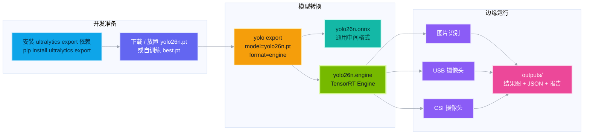
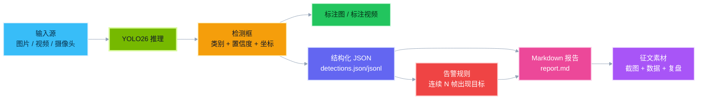

# OpenClaw YOLO26 Vision Agent

<p align="center">
  <b>Jetson Orin Nano Super × OpenClaw × YOLO26 × TensorRT</b><br>
  用自然语言调用边缘视觉模型，让 Jetson 成为可对话、可部署、可复盘的 AI 摄像头识别终端。
</p>

<p align="center">
  
  
  
  
  
</p>

---


## 0. 项目一句话

**OpenClaw YOLO26 Vision Agent** 是一个面向 **NVIDIA Jetson Orin Nano Super** 的边缘视觉识别项目：用户在 **OpenClaw TUI / WebChat** 中输入自然语言指令，例如“识别这张图片里有什么”“打开摄像头检测是否有人进入”“把 YOLO26 转成 TensorRT Engine”，OpenClaw 会调用本仓库封装好的 Python CLI，驱动 YOLO26 对图片、视频、USB 摄像头或 CSI 摄像头进行推理，并自动生成 **标注图、结构化 JSON、告警记录和 Markdown 检测报告**。

这个项目的目标不是再做一个只能手动运行命令的普通 YOLO Demo，而是把 YOLO26 变成 OpenClaw 可以理解和调用的视觉工具，让 Jetson 从“需要开发者记命令的开发板”升级成“可以通过自然语言控制的边缘 AI 终端”。

> 当前仓库定位：**代码级完整项目 + Jetson Orin Nano Super 目标部署方案 + OpenClaw 调用 Skill + YOLO26 图片/视频/摄像头识别闭环**。


---

## 1. 为什么做这个项目：应用场景与真实痛点

很多边缘 AI 项目看起来只是“摄像头 + 模型 + 检测框”，但真正落地时，问题往往不在模型本身，而在于 **如何让非算法人员也能稳定调用模型、如何减少云端依赖、如何让推理结果可追溯、如何把检测结果变成可复用的业务信息**。

在工厂巡检、桌面设备看护、仓库入侵检测、实验室安全监控、农业/养殖现场识别、机器人视觉感知等场景中，传统设备通常只能完成图像采集，无法理解画面内容。例如普通摄像头可以录视频，但不能回答“画面中有没有人靠近设备”“货架上是否出现指定物品”“检测结果是否需要告警”。如果所有画面都上传云端进行推理，又会遇到三类问题：第一是网络延迟和断网风险，边缘现场经常存在 Wi-Fi 不稳定、内网隔离或户外弱网环境；第二是隐私与合规风险，摄像头画面可能包含人员、设备布局、生产工艺等敏感信息；第三是长期成本问题，云端推理通常伴随带宽、API、存储和运维费用，项目规模一扩大，成本会迅速上升。

Jetson Orin Nano Super 适合承担这类边缘视觉入口：它体积小、功耗可控、支持 NVIDIA JetPack / CUDA / TensorRT 软件栈，可以在端侧完成视觉模型推理，减少对云端 GPU 的依赖。NVIDIA 官方资料显示，Jetson Orin Nano Super Developer Kit 可提供最高 67 INT8 TOPS AI 性能、102 GB/s 内存带宽，功耗范围为 7W–25W，适合机器人、视觉 AI 和边缘生成式 AI 原型开发。项目选择它作为目标平台，是为了在成本、体积、算力和生态成熟度之间取得平衡。

但是仅有 Jetson 和 YOLO 还不够。传统 YOLO 项目通常需要用户记住命令，例如：

```bash
 yolo predict model=yolo26n.engine source=0 save=False show
```

这对开发者来说可以接受，但对演示、教学、评审、现场运维人员并不友好。因此本项目引入 **OpenClaw** 作为 Agent 控制入口，把命令式操作封装为自然语言操作：用户不需要知道 `model`、`source`、`output`、`engine` 的具体参数，只需要告诉 OpenClaw“识别图片”“检测摄像头”“保存报告”，OpenClaw 就能按照 Skill 说明调用对应脚本。这样项目从“视觉算法 Demo”进一步变成“边缘 AI Agent 工作流”。

---

## 2. 项目亮点

| 亮点 | 说明 |
|---|---|
| 自然语言调用 YOLO26 | 通过 OpenClaw TUI / WebChat 输入任务，OpenClaw 按 Skill 说明生成并执行 YOLO26 命令 |
| Jetson Orin Nano Super 目标部署 | 面向 Jetson Orin Nano Super 编写部署说明、TensorRT 转换脚本和摄像头调用路径 |
| YOLO26 多输入源支持 | 支持图片、视频、USB 摄像头和 Jetson CSI 摄像头 |
| TensorRT Engine 加速链路 | 支持 `yolo export model=yolo26n.pt format=engine`，将 `.pt` 转为 `.engine` 后在 Jetson 上推理 |
| 结果可复盘 | 输出标注图/视频、`detections.json`、`detections.jsonl`、`alert_log.jsonl` 和 `report.md` |
| 适合征文展示 | README、部署文档、OpenClaw 使用文档、问题排查文档、征文草稿都已整理 |
| 不伪造实测数据 | 没有真实上板时，所有 FPS、功耗、温度、延迟均标注为“待实测” |

---

## 3. 总体架构：自然语言到边缘视觉识别

```mermaid
%%{init: {"theme": "base", "themeVariables": {"fontFamily": "Inter, Microsoft YaHei, sans-serif", "background": "#0B1020", "primaryColor": "#172554", "primaryTextColor": "#F8FAFC", "primaryBorderColor": "#38BDF8", "lineColor": "#94A3B8", "tertiaryColor": "#111827"}}}%%
flowchart LR
    U([用户<br/>自然语言指令]):::user

    subgraph A[OpenClaw Agent 控制层]
        TUI[OpenClaw TUI<br/>SSH/终端交互]:::agent
        WEB[OpenClaw WebChat<br/>网页控制台]:::agent
        SKILL[Skill<br/>openclaw-yolo26-vision]:::skill
    end

    subgraph J[Jetson Orin Nano Super 边缘端]
        CLI[Python CLI<br/>python -m yolo26_agent]:::code
        CAM[USB / CSI Camera]:::camera
        IMG[Image / Video Input]:::camera
        MODEL[YOLO26<br/>yolo26n.pt / best.engine]:::model
        TRT[TensorRT Engine<br/>端侧加速推理]:::trt
    end

    subgraph O[输出与展示]
        ANN[Annotated Image / Video<br/>标注图或视频]:::output
        JSON[detections.json<br/>detections.jsonl]:::output
        REPORT[report.md<br/>检测报告]:::report
        ALERT[Alert Rule<br/>连续 N 帧告警]:::alert
    end

    U --> TUI
    U --> WEB
    TUI --> SKILL
    WEB --> SKILL
    SKILL --> CLI
    CLI --> IMG
    CLI --> CAM
    CLI --> MODEL
    MODEL --> TRT
    TRT --> ANN
    TRT --> JSON
    JSON --> ALERT
    ALERT --> REPORT
    JSON --> REPORT

    classDef user fill:#F97316,stroke:#FED7AA,color:#111827,stroke-width:2px;
    classDef agent fill:#7C3AED,stroke:#DDD6FE,color:#FFFFFF,stroke-width:2px;
    classDef skill fill:#06B6D4,stroke:#A5F3FC,color:#042F2E,stroke-width:2px;
    classDef code fill:#2563EB,stroke:#BFDBFE,color:#FFFFFF,stroke-width:2px;
    classDef camera fill:#10B981,stroke:#A7F3D0,color:#052E16,stroke-width:2px;
    classDef model fill:#EAB308,stroke:#FEF3C7,color:#111827,stroke-width:2px;
    classDef trt fill:#76B900,stroke:#D9F99D,color:#111827,stroke-width:3px;
    classDef output fill:#22C55E,stroke:#BBF7D0,color:#052E16,stroke-width:2px;
    classDef report fill:#EC4899,stroke:#FBCFE8,color:#FFFFFF,stroke-width:2px;
    classDef alert fill:#EF4444,stroke:#FECACA,color:#FFFFFF,stroke-width:2px;
```



这张图表达了项目的核心逻辑：**OpenClaw 负责理解用户意图，YOLO26 负责视觉识别，Jetson 负责边缘推理，输出文件负责结果沉淀**。它不是把所有功能堆在一个脚本里，而是把自然语言交互、模型推理、告警判断、文件输出拆成清晰模块，便于后续替换模型、接入新摄像头或扩展到 ROS / DeepStream / Web Dashboard。

---

## 4. OpenClaw 调用流程：从一句话到一条 YOLO 命令

```mermaid
%%{init: {"theme": "base", "themeVariables": {"fontFamily": "Inter, Microsoft YaHei, sans-serif", "background": "#020617", "primaryTextColor": "#F8FAFC", "lineColor": "#CBD5E1"}}}%%
flowchart LR
    P1[1 用户输入<br/>“识别这张图片”]:::p1 --> P2[2 OpenClaw 解析任务<br/>选择视觉 Skill]:::p2
    P2 --> P3[3 Skill 生成命令<br/>python -m yolo26_agent image]:::p3
    P3 --> P4[4 加载 YOLO26<br/>yolo26n.pt / yolo26n.engine]:::p4
    P4 --> P5[5 推理与绘制<br/>boxes + labels + confidence]:::p5
    P5 --> P6[6 保存结果<br/>标注图 + JSON + report.md]:::p6
    P6 --> P7[7 OpenClaw 回复<br/>检测摘要 + 文件路径]:::p7

    classDef p1 fill:#FB923C,stroke:#FFEDD5,color:#111827,stroke-width:2px;
    classDef p2 fill:#A855F7,stroke:#F3E8FF,color:#FFFFFF,stroke-width:2px;
    classDef p3 fill:#06B6D4,stroke:#CFFAFE,color:#083344,stroke-width:2px;
    classDef p4 fill:#84CC16,stroke:#ECFCCB,color:#1A2E05,stroke-width:2px;
    classDef p5 fill:#3B82F6,stroke:#DBEAFE,color:#FFFFFF,stroke-width:2px;
    classDef p6 fill:#EC4899,stroke:#FCE7F3,color:#FFFFFF,stroke-width:2px;
    classDef p7 fill:#22C55E,stroke:#DCFCE7,color:#052E16,stroke-width:2px;
```



OpenClaw 的价值在于把“模型命令”变成“任务意图”。在实际演示中，用户可以这样说：

```text
识别 assets/demo_images/input.jpg 这张图片，模型使用 /home/jetson/ultralytics/yolo26n.engine，结果保存到 outputs/openclaw_image_demo。
```

OpenClaw 根据 `skills/openclaw-yolo26-vision/SKILL.md` 的说明，执行：

```bash
python3 -m yolo26_agent image \
  --model /home/jetson/ultralytics/yolo26n.engine \
  --source assets/demo_images/input.jpg \
  --output outputs/openclaw_image_demo
```

执行完成后，项目会自动生成：

```text
outputs/openclaw_image_demo/
├── annotated_input.jpg
├── detections.json
└── report.md
```

这样评审或读者能看到完整链路：用户不是手动敲 YOLO 命令，而是让 OpenClaw 作为 Agent 调用视觉工具。

---

## 5. Jetson 部署链路：YOLO26 到 TensorRT Engine



在 Jetson 上，`.pt` 模型可以直接运行，但为了更符合边缘部署目标，项目推荐转换为 TensorRT Engine。TensorRT 是 NVIDIA 用于优化和加速深度学习推理的 SDK，可接收 PyTorch、TensorFlow、ONNX 等来源的训练模型，并针对 NVIDIA GPU 做高性能部署优化，支持 FP32、FP16、INT8 等多种精度模式。Ultralytics 官方也提供 TensorRT 导出路径，常用命令是：

```bash
bash scripts/export_yolo26_engine.sh yolo26n.pt
```

或直接执行：

```bash
yolo export model=yolo26n.pt format=engine
```

在 Jetson Orin Nano Super 目标环境中，推荐把转换后的模型放在：

```text
/home/jetson/ultralytics/yolo26n.engine
```

如果使用自采集数据训练的模型，也可以使用：

```text
/home/jetson/ultralytics/ultralytics/data/yahboom_data/orange_data/runs/detect/train2/weights/best.engine
```

---

## 6. 数据产物闭环：不只检测，还能沉淀结果



这个闭环是本项目和普通检测脚本最大的区别之一。普通 YOLO Demo 通常只生成一张带框图片，而本项目会把结果拆成三类：第一类是视觉结果，便于展示；第二类是结构化结果，便于后续接入告警、数据库、Web Dashboard 或机器人系统；第三类是 Markdown 报告，便于写征文、复盘、归档和给非技术人员阅读。

---

## 7. 核心技术选型与 SDK 说明

### 7.1 硬件平台：Jetson Orin Nano Super

目标部署平台选择 **Jetson Orin Nano Super Developer Kit**。选择理由如下：

1. **算力合适**：YOLO26n 这类轻量视觉模型适合在 Orin Nano Super 上进行端侧推理，既能保持实时性，又不需要部署更昂贵的 AGX 级平台。
2. **功耗可控**：边缘设备通常需要长期运行，Jetson Orin Nano Super 的 7W–25W 功耗范围更适合桌面、机器人、小型工控盒和教学展示。
3. **接口友好**：Jetson 生态对 USB 摄像头、CSI 摄像头、GPIO、I2C、串口、ROS/ROS2 等外设支持更成熟，后续可以把视觉结果联动机械臂、小车、灯光、蜂鸣器或机器人底盘。
4. **软件生态完整**：JetPack、CUDA、cuDNN、TensorRT、OpenCV、DeepStream、ROS/ROS2 和 Isaac ROS 都可以围绕 Jetson 形成边缘 AI 技术栈。
5. **展示价值高**：征文场景不仅要能跑模型，还要说明边缘 AI 的完整流程；Jetson 本身就是面向边缘 AI、机器人和视觉 AI 的典型平台。

### 7.2 系统与核心 SDK

| 模块 | 选型 | 在项目中的作用 |
|---|---|---|
| JetPack | 推荐 JetPack 6.2 或 Yahboom Orin Nano Super 预装镜像 | 提供 Jetson Linux、CUDA、TensorRT、cuDNN 等基础运行环境 |
| CUDA | Jetson GPU 加速基础 | 支撑深度学习模型在 GPU 上运行 |
| cuDNN | 深度神经网络算子库 | 加速卷积、归一化、激活等神经网络基础算子 |
| TensorRT | 推理优化 SDK | 将 YOLO26 模型转换为 `.engine`，提升边缘端推理效率 |
| OpenCV | 摄像头与图像处理 | 读取图片/视频/USB 摄像头，保存标注视频，显示推理画面 |
| JetCam | CSI 摄像头接口 | 在 Jetson 上读取 CSI Camera 画面 |
| Ultralytics | YOLO26 模型训练、预测、导出 | 加载 YOLO26 模型，执行预测，导出 TensorRT Engine |
| OpenClaw | Agent 控制入口 | 通过 TUI / WebChat / Skill 调用本项目视觉工具 |
| Pytest | 基础测试 | 测试告警逻辑、报告生成逻辑，保证仓库不是纯文档 |

根据 NVIDIA JetPack 6.2 官方说明，JetPack 6.2 包含 Jetson Linux 36.4.3、Linux Kernel 5.15、Ubuntu 22.04 rootfs，并打包 CUDA 12.6、TensorRT 10.3、cuDNN 9.3、VPI 3.2、DLA 3.1 和 DLFW 24.0 等 AI 软件栈。因此，README 和部署文档以 JetPack 6.2 作为推荐基线，但如果你使用 Yahboom 已经配置好的 Orin Nano Super 镜像，可以直接跳过部分环境搭建步骤。

### 7.3 AI 模型：YOLO26

本项目默认使用 **YOLO26n** 作为演示模型，原因是：

- `n` 规模模型参数量较小，更适合边缘设备快速推理；
- Ultralytics CLI 统一，训练、预测、导出命令简单；
- 支持 `.pt`、`.onnx`、`.engine` 等部署格式；
- 可扩展到检测、分类、分割、姿态估计、OBB 等视觉任务；
- 可用 COCO 预训练模型快速演示，也可以替换为自训练 `best.pt` / `best.engine`。

如果需要识别特定对象，例如橙子、安全帽、实验器材、桌面设备、机器人配件或养殖场景对象，可以按如下流程扩展：

```mermaid
%%{init: {"theme": "base", "themeVariables": {"fontFamily": "Inter, Microsoft YaHei, sans-serif", "background": "#030712", "primaryTextColor": "#F9FAFB", "lineColor": "#9CA3AF"}}}%%
flowchart LR
    A[采集视频<br/>多角度、多光照]:::a --> B[抽帧生成图片<br/>每 N 帧取一张]:::b
    B --> C[Label Studio 标注<br/>导出 YOLO 格式]:::c
    C --> D[划分 train/val<br/>8:2 或 9:1]:::d
    D --> E[训练 YOLO26<br/>得到 best.pt]:::e
    E --> F[导出 TensorRT<br/>best.engine]:::f
    F --> G[OpenClaw 调用<br/>边缘识别]:::g

    classDef a fill:#06B6D4,stroke:#CFFAFE,color:#083344,stroke-width:2px;
    classDef b fill:#3B82F6,stroke:#DBEAFE,color:#FFFFFF,stroke-width:2px;
    classDef c fill:#A855F7,stroke:#F3E8FF,color:#FFFFFF,stroke-width:2px;
    classDef d fill:#F59E0B,stroke:#FEF3C7,color:#111827,stroke-width:2px;
    classDef e fill:#22C55E,stroke:#DCFCE7,color:#052E16,stroke-width:2px;
    classDef f fill:#76B900,stroke:#D9F99D,color:#111827,stroke-width:3px;
    classDef g fill:#EC4899,stroke:#FBCFE8,color:#FFFFFF,stroke-width:2px;
```



### 7.4 辅助开发工具

| 工具 | 用途 |
|---|---|
| VS Code / Trae | 编写、重构和管理项目代码 |
| Git / GitHub | 版本管理、征文项目公开展示 |
| Label Studio | 标注自定义目标检测数据集 |
| Jtop | Jetson 资源监控，查看 CPU/GPU/内存/温度/功耗 |
| OpenClaw TUI | 通过 SSH 终端进行自然语言交互 |
| OpenClaw Gateway / WebChat | 在网页端调用 Agent 和 Skill |
| Docker | 后续可封装为可复现部署环境 |
| pytest | 保证关键逻辑可测试 |

---

## 8. 完整开发流程与核心实现思路

本项目按“先跑通核心识别，再接入 OpenClaw，最后补 Jetson 部署和征文材料”的顺序开发。

### 8.1 立项与功能拆分

项目最初目标是“做一个可以参加 Jetson 开发者征文的代码级项目”。为了避免只写空泛文章，仓库必须包含可运行代码、真实命令、部署说明和结果产物。因此功能被拆成四层：

1. **模型推理层**：`yolo26_agent/detector.py` 负责加载 YOLO26 模型，执行图片、视频、USB 摄像头和 CSI 摄像头推理。
2. **命令接口层**：`yolo26_agent/cli.py` 提供统一 CLI，便于 OpenClaw 或用户直接调用。
3. **结果沉淀层**：`report.py`、`alert.py` 和 `io_utils.py` 负责生成报告、告警和结构化文件。
4. **Agent 调用层**：`skills/openclaw-yolo26-vision/SKILL.md` 告诉 OpenClaw 如何把自然语言任务映射到具体命令。

### 8.2 环境搭建

普通 PC 上可以先安装基础依赖，用于检查代码结构、报告生成和图片推理：

```bash
pip install -r requirements.txt
```

Jetson Orin Nano Super 上推荐安装 Jetson 依赖：

```bash
pip install -r requirements-jetson.txt
```

如果使用官方或课程镜像中已预装 Ultralytics / TensorRT / OpenCV 的环境，可以先直接运行示例，确认摄像头和模型路径无误。

### 8.3 模型转换

在 Jetson 上执行：

```bash
bash scripts/export_yolo26_engine.sh yolo26n.pt
```

成功后会生成：

```text
yolo26n.onnx
yolo26n.engine
```

其中 `.onnx` 是通用中间格式，`.engine` 是 TensorRT 针对当前设备和环境构建的推理引擎。注意：TensorRT Engine 通常和设备、TensorRT 版本、CUDA 版本存在绑定关系，不建议把一台机器生成的 `.engine` 直接拿到另一台不同环境机器上使用。

### 8.4 图片识别

```bash
python3 -m yolo26_agent image \
  --model /home/jetson/ultralytics/yolo26n.engine \
  --source assets/demo_images/input.jpg \
  --output outputs/image_demo
```

### 8.5 视频识别

```bash
python3 -m yolo26_agent video \
  --model /home/jetson/ultralytics/yolo26n.engine \
  --source assets/demo_videos/demo.mp4 \
  --output outputs/video_demo \
  --alert-classes person \
  --alert-frames 5
```

### 8.6 USB 摄像头识别

```bash
python3 -m yolo26_agent camera-usb \
  --model /home/jetson/ultralytics/yolo26n.engine \
  --camera-id 0 \
  --output /home/jetson/ultralytics/output/openclaw_yolo26_usb \
  --show
```

### 8.7 CSI 摄像头识别

```bash
python3 -m yolo26_agent camera-csi \
  --model /home/jetson/ultralytics/yolo26n.engine \
  --output /home/jetson/ultralytics/output/openclaw_yolo26_csi \
  --show
```

---

## 9. OpenClaw 使用方式

### 9.1 安装 Skill

将 Skill 复制到 OpenClaw 工作区：

```bash
mkdir -p ~/.openclaw/workspace/skills
cp -r skills/openclaw-yolo26-vision ~/.openclaw/workspace/skills/
```

重启或新开 OpenClaw 会话，让 Skill 生效：

```bash
openclaw tui
```

### 9.2 示例自然语言指令

```text
请使用 OpenClaw YOLO26 Vision Agent 识别 assets/demo_images/input.jpg，模型使用 /home/jetson/ultralytics/yolo26n.engine，输出到 outputs/openclaw_image_demo。
```

```text
打开 USB 摄像头，用 yolo26n.engine 实时检测画面，如果连续 5 帧出现 person 就记录告警。
```

```text
把 yolo26n.pt 转换成 TensorRT Engine，并告诉我生成的 engine 文件路径。
```

OpenClaw 的插件资料显示，插件可以扩展命令、工具、Gateway RPC、CLI 命令和 Skills；Skills 也可以通过包含 `SKILL.md` 的文件夹被加载。本仓库选择 Skill 方式，是因为它更轻量，更适合把 YOLO26 的调用说明交给 OpenClaw，而不需要一开始就编写完整 TypeScript 插件。

---

## 10. 项目目录结构

```text
openclaw-yolo26-vision-agent/
├── README.md
├── requirements.txt
├── requirements-jetson.txt
├── config.example.yaml
├── yolo26_agent/
│   ├── cli.py
│   ├── detector.py
│   ├── alert.py
│   ├── report.py
│   ├── config.py
│   └── io_utils.py
├── scripts/
│   ├── export_yolo26_engine.sh
│   ├── run_image_detect.sh
│   ├── run_video_detect.sh
│   ├── run_usb_camera_detect.sh
│   └── run_csi_camera_detect.sh
├── skills/
│   └── openclaw-yolo26-vision/
│       └── SKILL.md
├── docs/
│   ├── article_draft.md
│   ├── architecture.md
│   ├── jetson_orin_nano_super_deploy.md
│   ├── openclaw_usage.md
│   └── troubleshooting.md
├── assets/
│   ├── demo_images/
│   └── demo_videos/
├── outputs/
│   └── .gitkeep
└── tests/
    ├── test_alert.py
    └── test_report.py
```

---

## 11. 效果展示建议

你已经有 YOLO26 识别好的图片，可以放到：

```bash
assets/demo_images/
```

然后在 README 中加入：

```markdown

```

推荐展示素材组合如下：

| 展示素材 | 放置位置 | 说明 |
|---|---|---|
| YOLO26 标注结果图 | `assets/demo_images/` | GitHub 首页最直观展示 |
| OpenClaw TUI 调用截图 | `assets/demo_images/` | 证明自然语言调用流程 |
| Jetson 终端运行截图 | `assets/demo_images/` | 证明目标部署平台 |
| TensorRT 导出截图 | `assets/demo_images/` | 证明 `.pt → .engine` 链路 |
| Jtop 资源监控截图 | `assets/demo_images/` | 记录温度、功耗、CPU/GPU 占用 |
| 输出报告截图 | `outputs/.../report.md` | 证明项目不止检测，还能归档结果 |

如果用于征文，建议最终效果表格这样写，待真实上板后再填写具体数值：

| 指标 | 当前状态 | 记录方式 |
|---|---|---|
| 图片识别 | 已支持 | 标注图 + detections.json |
| 视频识别 | 已支持 | 标注视频 + detections.jsonl |
| USB 摄像头 | 已支持 | OpenCV VideoCapture |
| CSI 摄像头 | 已支持 | JetCam CSICamera |
| TensorRT Engine | 已支持转换脚本 | `yolo export model=yolo26n.pt format=engine` |
| FPS | 待 Jetson 实测 | 建议用 benchmark 或终端日志记录 |
| 功耗 | 待 Jetson 实测 | 建议用 jtop 截图记录 |
| 温度 | 待 Jetson 实测 | 建议用 jtop 截图记录 |
| 延迟 | 待 Jetson 实测 | 建议在推理代码中记录单帧耗时 |

---

## 12. 开发难点、排查过程与解决方案

### 12.1 难点一：OpenClaw 如何调用视觉脚本

**问题现象**：OpenClaw 本身是 Agent 网关和交互入口，并不是 YOLO 推理框架。如果直接让模型自由发挥，它可能会生成不稳定命令，路径也可能错误。

**原因分析**：视觉任务需要明确模型路径、输入路径、输出目录和摄像头类型。没有 Skill 约束时，Agent 很容易把“识别图片”理解成泛泛的说明，而不是执行固定命令。

**解决方案**：在 `skills/openclaw-yolo26-vision/SKILL.md` 中明确列出图片、视频、USB 摄像头、CSI 摄像头和模型转换的标准命令。OpenClaw 只需要按 Skill 模板填参数，就能稳定调用项目 CLI。

### 12.2 难点二：PC 开发环境与 Jetson 环境不一致

**问题现象**：在 PC 上可以安装 Ultralytics 并运行 `.pt` 模型，但无法直接验证 Jetson 的 TensorRT Engine、CSI 摄像头和 JetCam。

**原因分析**：TensorRT、JetCam、Jetson 摄像头驱动和 CUDA/cuDNN 环境都依赖 Jetson 系统栈，不能完全在普通 PC 上模拟。

**解决方案**：项目拆成两套依赖：`requirements.txt` 用于 PC 基础开发，`requirements-jetson.txt` 用于 Jetson 部署。代码中对 CSI 摄像头和缺失依赖做错误提示，不在 PC 上强行导入 Jetson 专用库。

### 12.3 难点三：TensorRT Engine 的可移植性

**问题现象**：`.engine` 文件可能在一台机器上可用，换到另一台 Jetson 或不同 TensorRT 版本后失败。

**原因分析**：TensorRT Engine 通常针对具体硬件、TensorRT 版本、CUDA 版本和模型输入配置进行构建，跨环境复用存在兼容性风险。

**解决方案**：仓库不提交 `.engine` 大文件，而是提供 `scripts/export_yolo26_engine.sh`，让用户在目标 Jetson 上本地生成 Engine。这样更符合部署实践，也避免 GitHub 仓库存放大模型文件。

### 12.4 难点四：实时摄像头推理容易卡顿

**问题现象**：USB 摄像头或 CSI 摄像头实时显示时，如果模型过大、分辨率过高或窗口显示占用资源，画面可能卡顿。

**原因分析**：边缘设备算力有限，摄像头采集、图像预处理、模型推理、结果绘制、视频编码、窗口显示都在争抢资源。

**解决方案**：第一版默认 640×480 分辨率；优先使用 YOLO26n 轻量模型；推理阶段可降低 `imgsz`；部署阶段使用 TensorRT Engine；如果仅需要后台告警，可以关闭 `--show`，减少 GUI 显示开销。

### 12.5 难点五：结果展示不能只停留在图片

**问题现象**：征文评审需要看到项目完整性，如果只有一张检测图，很难体现工程价值。

**原因分析**：真实项目需要可复盘、可追踪、可交付，结构化结果和报告比单张图片更能体现工程闭环。

**解决方案**：项目默认输出 `detections.json` / `detections.jsonl` 和 `report.md`。这样可以在文章中展示“输入、推理、结构化结果、告警、报告”的完整链路。

---

## 13. 当前限制与后续优化

当前版本重点是“代码级完整展示”和“Jetson-ready 部署链路”，仍有一些可继续优化的方向：

1. **真实 Jetson Benchmark**：接入真实 Jetson Orin Nano Super 后，补充 FPS、平均延迟、P95 延迟、功耗、温度和内存占用。
2. **Web Dashboard**：增加 Streamlit / Gradio / FastAPI 前端，把检测图、类别统计和告警日志可视化。
3. **DeepStream 管线**：对于多路摄像头或 RTSP 流，可以将视频处理迁移到 DeepStream，进一步提升边缘视频分析工程性。
4. **ROS2 集成**：把检测结果发布成 ROS2 Topic，让机器人底盘、机械臂或导航系统订阅视觉结果。
5. **GPIO 联动**：当检测到指定对象时，联动 GPIO 控制 LED、蜂鸣器、继电器或舵机，实现视觉到外设的闭环。
6. **自定义数据集训练**：用 Label Studio 标注特定对象，训练 `best.pt`，再导出 `best.engine`，提升特定场景识别效果。
7. **多模态 Agent**：结合 Qwen / LLaVA / MiniCPM-V 等视觉语言模型，让 OpenClaw 不仅识别类别，还能解释场景。

---

## 14. 快速开始

### 14.1 克隆仓库

```bash
git clone git@github.com:YOUR_NAME/openclaw-yolo26-vision-agent.git
cd openclaw-yolo26-vision-agent
```

### 14.2 安装依赖

```bash
pip install -r requirements.txt
```

Jetson 上：

```bash
pip install -r requirements-jetson.txt
```

### 14.3 运行图片识别

```bash
python3 -m yolo26_agent image \
  --model /home/jetson/ultralytics/yolo26n.engine \
  --source assets/demo_images/input.jpg \
  --output outputs/image_demo
```

### 14.4 运行视频识别

```bash
python3 -m yolo26_agent video \
  --model /home/jetson/ultralytics/yolo26n.engine \
  --source assets/demo_videos/demo.mp4 \
  --output outputs/video_demo \
  --alert-classes person \
  --alert-frames 5
```

### 14.5 运行 USB 摄像头识别

```bash
python3 -m yolo26_agent camera-usb \
  --model /home/jetson/ultralytics/yolo26n.engine \
  --camera-id 0 \
  --output outputs/usb_camera_demo \
  --show
```

### 14.6 运行测试

```bash
pytest -q
```

---

## 15. GitHub 推送

```bash
git init
git branch -M main
git add .
git commit -m "feat: add OpenClaw YOLO26 Vision Agent"
git remote add origin git@github.com:YOUR_NAME/openclaw-yolo26-vision-agent.git
git push -u origin main
```

注意不要提交：

```text
*.pt
*.engine
*.onnx
outputs/*
.env
OpenClaw token
API Key
大视频文件
```

---

## 16. 征文写作可直接复用的摘要

**项目名称**：OpenClaw YOLO26 Vision Agent：基于 Jetson Orin Nano Super 的自然语言边缘视觉识别助手。

**项目定位**：这是一个面向边缘 AI 场景的视觉检测 Agent 项目，使用 Jetson Orin Nano Super 作为目标部署平台，使用 YOLO26 作为目标检测模型，使用 TensorRT Engine 进行边缘推理加速，并通过 OpenClaw TUI / WebChat 实现自然语言调用。

**解决问题**：传统摄像头无法理解画面内容，云端推理存在延迟、隐私、断网和长期成本问题；普通 YOLO Demo 又需要用户记忆复杂命令，不适合现场运维、教学演示和低代码部署。本项目将 YOLO26 封装成 OpenClaw 可调用的视觉工具，让用户用自然语言完成图片识别、摄像头检测、模型转换、结果保存和报告生成。

**核心功能**：支持图片、视频、USB 摄像头和 CSI 摄像头输入；支持 `.pt` 和 `.engine` 模型；支持 YOLO26 转 TensorRT Engine；支持检测结果标注、JSON 结构化保存、连续帧告警和 Markdown 报告输出。

**创新点**：项目不是单纯运行 YOLO，而是把 YOLO26 推理能力接入 OpenClaw Agent 工作流；不是只展示检测图，而是形成“自然语言指令 → 边缘推理 → 结构化结果 → 告警 → 报告”的完整闭环。

---

## 17. 参考资料

- NVIDIA Jetson Orin Nano Super Developer Kit 官方介绍：https://www.nvidia.com/en-us/autonomous-machines/embedded-systems/jetson-orin/nano-super-developer-kit/
- NVIDIA Jetson Orin Nano Developer Kit User Guide：https://docs.nvidia.com/jetson/orin-nano-devkit/user-guide/latest/index.html
- NVIDIA JetPack 6.2：https://developer.nvidia.com/embedded/jetpack-sdk-62
- NVIDIA TensorRT Documentation：https://docs.nvidia.com/deeplearning/tensorrt/latest/index.html
- Ultralytics TensorRT Export：https://docs.ultralytics.com/integrations/tensorrt/
- Ultralytics Model Export：https://docs.ultralytics.com/modes/export/
- Label Studio：https://github.com/HumanSignal/label-studio

---

## 18. License

MIT License. See `LICENSE` for details.

